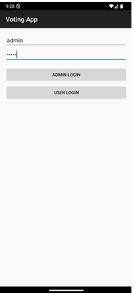
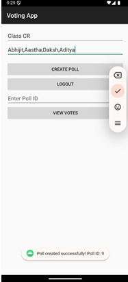
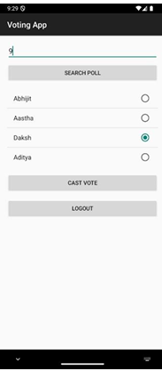
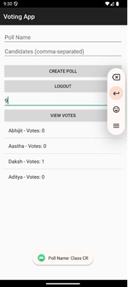

# 🗳️ BalletBox — Online Voting Application

## 📄 Project Overview

**BalletBox** is a secure and user-friendly Android-based voting application designed to simplify the election process for both voters and administrators. Developed using **Android Studio (Java)** and integrated with **Firebase Realtime Database** and **Firebase Authentication**, the app tackles common voting challenges like accessibility, security, and data integrity.

---

## 🛠️ Tech Stack

| Component      | Technology              |
|----------------|--------------------------|
| Frontend      | Android Studio (Java)    |
| Backend       | Firebase Realtime Database |
| Authentication| Firebase Authentication  |

---

## 🚀 Features

- Secure user registration and login with email verification  
- Role-based access control for voters and administrators  
- Real-time vote casting and counting  
- Poll creation, search, and result viewing features  
- Intuitive mobile interface for a seamless user experience  

---

| Screenshot         | Description            |
| ------------------ | ---------------------- |
|  | Login Page             |
|  | Poll Creation          |
|  | Search Poll            |
|  | View Votes / Cast Vote |

